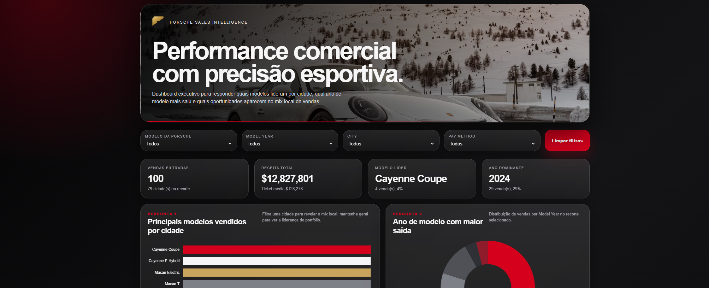

# 🏎️ Porsche Sales Dashboard

### Análise de Dados | Inteligência Artificial | Data Visualization

Este projeto nasceu de uma proposta simples: **até onde podemos chegar utilizando inteligência artificial para transformar dados em informações visuais e relevantes, mesmo com pouco tempo de desenvolvimento?**

A partir de uma base fictícia de vendas de veículos Porsche, desenvolvi um dashboard interativo em HTML, utilizando o **ChatGPT como ferramenta de apoio** durante as etapas de estruturação, desenvolvimento e refinamento visual.

O objetivo foi explorar, na prática, como a inteligência artificial pode acelerar a criação de soluções, desde a interpretação de dados até a construção de interfaces para análise de indicadores.

## 🚀 Sobre o projeto

O Porsche Sales Dashboard é um projeto pessoal de estudo voltado à exploração de dados e ao desenvolvimento assistido por inteligência artificial.

A proposta foi utilizar uma base de dados fictícia, organizar as informações e transformá-las em uma interface capaz de apresentar indicadores comerciais de maneira clara, intuitiva e visualmente atrativa.

Além da parte analítica, também busquei desenvolver uma interface inspirada na identidade visual da Porsche, priorizando um design elegante, com cores escuras e elementos que valorizam a experiência do usuário.

## 📊 Funcionalidades

O dashboard permite explorar informações como:

- **Vendas por modelo:** identificação dos veículos com maior volume de vendas.
- **Análise geográfica:** comparação dos modelos comercializados em diferentes cidades.
- **Ano do modelo:** visualização da distribuição das vendas por ano.
- **Preferências de pagamento:** análise das modalidades utilizadas nas compras.
- **Indicadores comerciais:** apresentação de KPIs para facilitar a interpretação dos dados.
- **Filtros interativos:** exploração dos resultados a partir de diferentes critérios.

## 🛠️ Tecnologias e ferramentas

| Tecnologia | Aplicação |
|---|---|
| HTML5 | Estrutura da dashboard |
| CSS3 | Estilização e identidade visual |
| JavaScript | Interatividade e manipulação dos dados |
| Chart.js | Visualização gráfica |
| ChatGPT | Apoio na geração, estruturação e refinamento do código |
| Git e GitHub | Versionamento e publicação |
| GitHub Pages | Hospedagem da aplicação |

## 🧠 Processo de desenvolvimento

O desenvolvimento foi realizado de forma experimental, utilizando a inteligência artificial como principal ferramenta de apoio.

**1. Exploração dos dados**

O ponto de partida foi uma base fictícia contendo informações sobre vendas de veículos Porsche. A partir dela, foram identificados os campos relevantes para a construção dos indicadores.

**2. Definição das perguntas de negócio**

Antes da criação da interface, foram estabelecidas perguntas que o dashboard deveria ajudar a responder, como:

- Quais modelos apresentam maior volume de vendas por cidade?
- Quais anos de modelo se destacam nas vendas?
- Como as preferências de compra variam entre diferentes localidades?

**3. Desenvolvimento com IA**

Com os objetivos definidos, utilizei o ChatGPT para auxiliar na geração do código HTML, CSS e JavaScript, transformando as informações da base em uma dashboard interativa.

**4. Refinamento visual**

Após a criação da primeira versão, realizei novas interações com a IA para aprimorar a interface, ajustando cores, organização dos elementos e apresentação das informações.

**5. Publicação**

Por fim, utilizei Git e GitHub para versionar o projeto e o GitHub Pages para disponibilizar a aplicação na web.

## 🎯 Aprendizados

Mais do que desenvolver uma dashboard, este projeto foi uma oportunidade de explorar novas formas de trabalhar com tecnologia.

Durante o processo, pude praticar:

- Estruturação de perguntas de negócio a partir de dados.
- Organização de informações para visualização.
- Utilização de prompts para orientar a geração de código.
- Refinamento iterativo de interfaces com apoio de IA.
- Noções de UI/UX aplicadas a dashboards.
- Versionamento e publicação de aplicações web.

Um dos principais aprendizados foi perceber que **a qualidade das instruções fornecidas à IA influencia diretamente a qualidade dos resultados obtidos**.

## 🤖 O papel da inteligência artificial

A utilização do ChatGPT foi parte central deste experimento.

Em vez de desenvolver cada componente manualmente, explorei um fluxo de trabalho baseado em instruções, análise dos resultados e refinamentos sucessivos.

A intenção não foi apresentar o código como inteiramente desenvolvido por mim, mas demonstrar como ferramentas de IA podem ser utilizadas de maneira prática para acelerar a criação de soluções e apoiar o aprendizado.

## 📌 Considerações finais

Este é um projeto de estudo, desenvolvido com dados fictícios e sem qualquer vínculo oficial com a Porsche.

A experiência reforçou meu interesse pela combinação de **tecnologia, análise de dados e inteligência artificial**, especialmente pelo potencial dessas ferramentas na criação de soluções que normalmente exigiriam mais tempo de desenvolvimento.

O projeto também representa uma oportunidade de continuar evoluindo meus conhecimentos em desenvolvimento web, visualização de dados e uso de IA como ferramenta de produtividade.

### 🌐 Demonstração

🔗 [Acessar Dashboard Interativa](https://digitalinnovationone.github.io/dashboard_porsche_sales/)

⭐ **Gostou do projeto?** Sinta-se à vontade para explorar o código, testar a dashboard e compartilhar sugestões!

*Projeto desenvolvido para fins educacionais e de portfólio.*